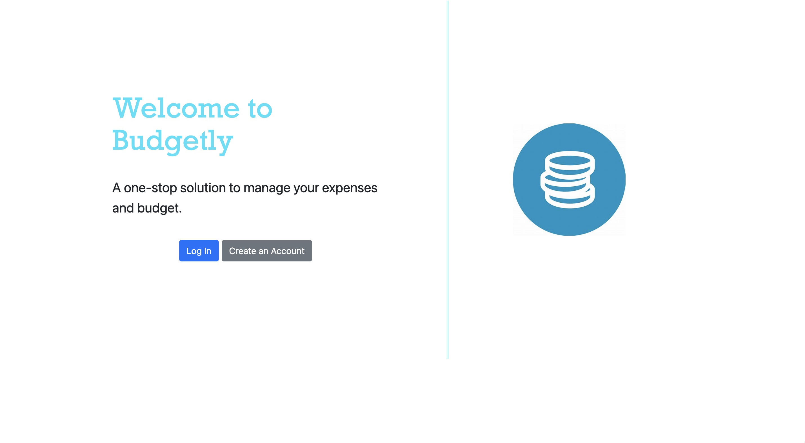
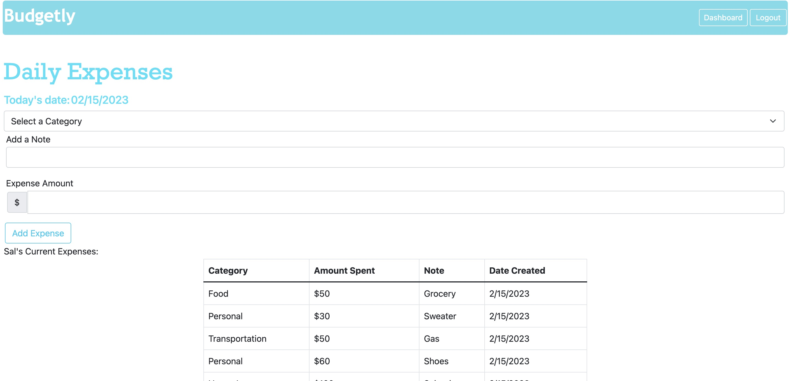
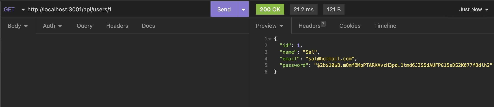
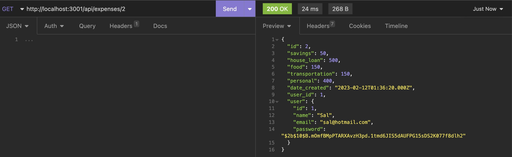
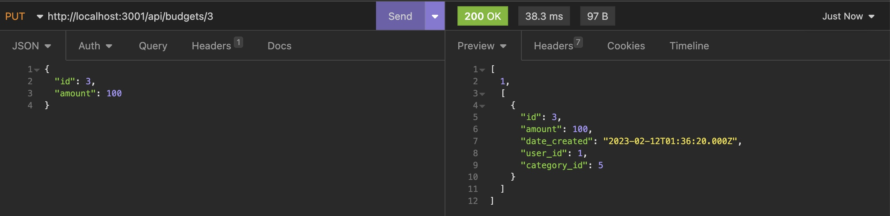
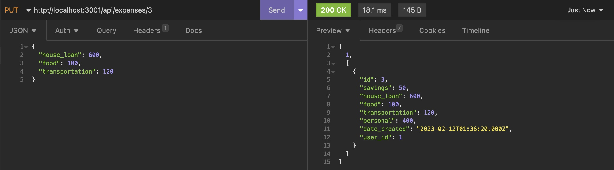

# Budgetly

## Description

Budgetly is a budgeting application that allows users to easily manage their finances. Budgetly analyzes your income and expenses and helps you understand how much you have available to spend per month. 

Users can view past spending patterns by category and make it easy to create future spending goals. Users can create an account, login, input daily expenses, create budget goals, and track their expense comparisons. Users will gain a visual understanding of their budgets by category and understand their remaining funds. 

With Budgetly, users have an easy way to track their finances and optimize their budget.

## User Story

As a user,
I WANT to track my expenses all in one place 
SO THAT I can keep my spending within my budget.

## Acceptance Criteria

GIVEN a budget dashboard with form inputs
WHEN I click on add a budget, and input the category and amount 
THEN I am presented with a new budget goal alongside its budget, amount, and fund remaining.
WHEN I click on update a budget, and input the category and amount 
THEN I am presented with an updated budget goal alongside its budget, amount, and fund remaining.
WHEN I click on the 'expenses' option in the navigation bar
THEN I am presented with a new page that display up to 50 of my most recent expenses
WHEN I input a category, description, and amount
THEN I am presented with a new expense described by its category, description, and amount, and the fund remaining in the budget dashboard updates.
WHEN I click on the 'logout' option in the navigation bar
THEN I am logged out of Budgetly 


## Technology Used

* Uses the [express package](https://www.npmjs.com/package/express).
* Uses the [mysql2 package](https://www.npmjs.com/package/mysql2) 
* Uses the [sequelize package](https://www.npmjs.com/package/sequelize) 
* Uses the [dotenv package](https://www.npmjs.com/package/dotenv) 
* Uses the [d3 Javascript library](https://d3js.org/)

## Installation

  To install necessary dependencies, run the following command:
  ```
  npm i
  ```
  To install necessary database, schema and seed data, run the following commands in mysql2 CLI:
  ```
  source db/schema.sql
  ```
  Create an .env file
  ```
  Rename .env_EXAMPLE file to .env
  Add the database name, your username and password for mysql server, the database host and port in the.env file
  ```
  To create the seed data, do the following steps:
  ```
  npm run seed
  ```
  Run the server using the following command:
  ```
  node server
  ```
  

### Database Models

The databse contains the following four models:

* `BudgetCategory`

  * `id`

    * Integer.
  
    * Doesn't allow null values.
  
    * Set as primary key.
  
    * Uses auto increment.

  * `category`
  
    * String.
  
    * Doesn't allow null values.

* `Budget`

  * `id`
  
    * Integer.
  
    * Doesn't allow null values.
  
    * Set as primary key.
  
    * Uses auto increment.

  * `amount`
  
    * Decimal.

  * `fund_remaining`
  
    * Decimal.
* `user_id`
  
    * Integer.
  
    * References the `User` model's `id`

  * `category_id`
  
    * Integer.
  
    * References the `BudgetCategory` model's `id`.

* `Expense`

 * `id`
  
    * Integer.
  
    * Doesn't allow null values.
  
    * Set as primary key.
  
    * Uses auto increment.

  * `amount_spent`
  
    * Decimal.

  * `note
  
    * String.

* `user_id`
  
    * Integer.
  
    * References the `User` model's `id`

  * `category_id`
  
    * Integer.
  
    * References the `BudgetCategory` model's `id`.

### Associations

* `Budget` and `Expense` belongs to `User`, and `User` has many `Budget` and `Expense` models

* `Budget` and `Expense` belongs to `BudgetCategory`, and `BudgetCategory` has many `Budget` and `Expense` models


## Usage

1. 1. You can access the file in GitHub repository: https://github.com/rbhumbla1/E-Commerce-Back-End
2. Run the application in the terminal using this command: 
```
node server
```
3. Open the website using the following link:

    <!-- need to add -->
    [Live website](https://budget-app-nodejs.herokuapp.com/)

4. Click the 'Create an account' button if you do not already have an account.

5. Enter your budget goals with the following information: category and amount.

6. Click the '+' button to set the current budget goal.

7. In the 'expenses' page (accessible through the navigation bar), add your expenses using the folling information: category, description, and amount.

8. Click the 'Add Expense' button to set the current expense.

9. Return to the budget 'dashboard' (accessible through the navigation bar), and view your fund remaining by category.

<!-- Here is a [Link](https://drive.google.com/file/d/1J98GbnfviYuA_mH7z8nOgGvGrsD6c4Bs/view?usp=sharing) to a walkthrough video that demonstrates the functionality of the application. -->

Example of the application's appearance and functionality:





## Tests

Insomnia testing:







## Contributors

* [Adena Marom](https://github.com/AdMarom)

* [Deorren Erive](https://github.com/erive92d)

* [Karrine Sagir](https://github.com/karinnesagir)

* [Rima Bhumbla](https://github.com/rbhumbla1)


## Questions

  If you have any questions about the repository and project, or would like to open an issue or would like to contact us for contributing or any other subject, you can contact the owners

